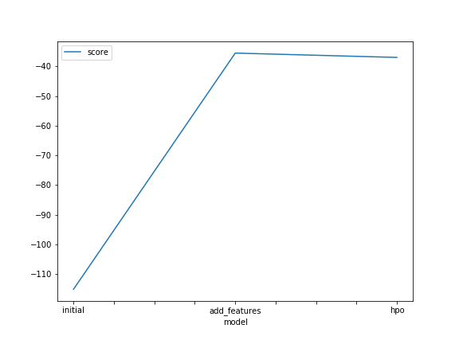

# Report: Predict Bike Sharing Demand with AutoGluon Solution
Neil Simon

## Initial Training
### What did you realize when you tried to submit your predictions? What changes were needed to the output of the predictor to submit your results?
I realised that I would have to collate the output `count` values to corresponding datetime values as were in the `sampleSubmissions.csv` file. This was done by simply replacing the values in the sample with the values in the prediciton output. Additionally, I realised that my initial prediction output had 3 negative values, which I cleaned up and made sure to do for all submissions.

### What was the top ranked model that performed?
WeightedEnsemble_L3 was the top ranked model.

## Exploratory data analysis and feature creation
### What did the exploratory analysis find and how did you add additional features?
My exploratory analysis determined `datetime` was a poor feature to use as the useful information re day, hour and month was not being considered separately from each other and from the year (the much larger and influencing value). I realised that `atemp` and `temp` were closely related, and that maybe the difference between the two would actually provide useful information for a model, so I created `dtemp` by subtracting one from the other. In addition, it is clear that some of the data is skewed. It may make sense to normalise this data, but for the purposes of this project, I have not done so.

### How much better did your model preform after adding additional features and why do you think that is?
My model performed signficantly better after adding the above additional features. The predictions went from having a very high error in training (115) and poor result in evaluation by Kaggle (1.39) to giving relatively acceptable results in training (35.5) and evaluation by Kaggle (0.483). I believe that this was predominantly due to the inclusion of `hour` in the feature set.

## Hyper parameter tuning
### How much better did your model preform after trying different hyper parameters?
My model running tuned hyperparameters performed about as well in training (37.0) but significantly worse in evaluation by Kaggle (0.548). I tried multiple different tunings and none matched the default settings for AutoGluon's Tabular Predictor when its predictions were evaluated by Kaggle.

### If you were given more time with this dataset, where do you think you would spend more time?
If I had more time with this dataset, I would create new features such as including using the features from previous days to add features for the current day. Additionally, I would use a lot longer for the training time to further refine the results. I do not believe that hyperparameter tuning is likely to give as significant an increase in performance, but I would continue to examine possible improvements there too.

### Create a table with the models you ran, the hyperparameters modified, and the kaggle score.
|model|num_boost_round|learning_rate|num_trials|score|
|--|--|--|--|--|
|initial|100|1|1024|1.39626|
|add_features|100|1|1024|0.48333|
|hpo|500|0.075|2048|0.54795|

### Create a line plot showing the top model score for the three (or more) training runs during the project.

### Create a line plot showing the top kaggle score for the three (or more) prediction submissions during the project.

## Summary
It is clear that AutoGluon's Tabular Predictor is a very capable AutoML tool. It massively simplifies the process of testing different ML models, gives good results without much setup, and has sensibly chosen default settings. This project demonstrated this as, after multiple attempts to find better hyperparameters, I was unable to improve on the default results. The only large improvement made was by adding new features to the dataset. By breaking up the `datatime` feature into its components of `hour`, `day`, `month` and `year`, the resulting predictions were much better than before. I suspect that continued creation of new features is the most likely approach to result in better predictions.

## Resources used
* https://auto.gluon.ai/dev/tutorials/tabular_prediction/index.html
* https://lightgbm.readthedocs.io/en/latest/pythonapi/lightgbm.train.html
* https://pandas.pydata.org/pandas-docs/stable/index.html
